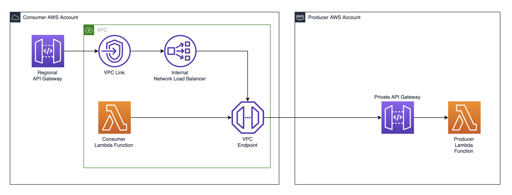

# AWS Cross Account Private API Patterns

This repository contains example patterns for consuming Private API Gateways across AWS Accounts



## Getting Started

The examples are provisioned using the Cloud Development Kit (CDK). To install the CDK locally, follow the instructions in the [CDK documentation](https://docs.aws.amazon.com/cdk/v2/guide/getting_started.html#getting_started_install):

```
npm install -g aws-cdk
```

With CDK installed, there are then 3 stacks to deploy. The consumer VPC & VPC Endpoint has to be created first. The producer is the account which the API Gateway is deployed into. The consumer API then contains 2 patterns for securely consuming the private API in the producer account.

First bootstrap and deploy the consumer VPC stack. This is deployed into the consumer AWS account and will create the core networking resources, including the VPC endpoint to be used by the consuming API. Pass the Account ID of the producer AWS account into this stack as a parameter:

```
cd consumer && npm i && cdk bootstrap
```

```
cdk deploy ConsumerVpcStack --parameters producerAccountId=12345678910
```

Then bootstrap and deploy the producer CDK application. This is deployed into the producer AWS account. This will provision the API that will be consumed in the consumer account. Copy the ConsumerVPCe and ApiKeySecretArn outputs from the output of the first stack to pass into the producer stack (this is used to lock down the trust policy on the private API to just this endpoint) e.g. `vpce-0e3ca9432b3e8cba6` & `arn:aws:secretsmanager:eu-west-2:12345678910:secret:CrossAccountAPIKeyabc123-def456`:

```
cd ../producer && npm i && cdk bootstrap
```

```
cdk deploy --parameters ConsumerVPCe=vpce-0e3ca9432b3e8cba6 --parameters ApiKeySecretArn=arn:aws:secretsmanager:eu-west-2:12345678910:secret:CrossAccountAPIKeyabc123-def456
```

Finally deploy the consumer API stack. This is deployed into the consumer AWS account. This will provision the API & Lambda functions that can be used to consume the private API in the producer account. Use the output API URL from the previous stack as a parameter in this final stack (e.g. `https://abc123def.execute-api.eu-west-2.amazonaws.com/prod/widgets`). Also provide the AWS Account ID of the producer account:

```
cd ../consumer
```

```
cdk deploy ConsumerApiStack --parameters targetApiUrl=https://<YOUR API ID>.execute-api.<YOUR REGION>.amazonaws.com/prod/widgets --parameters producerAccountId=12345678910
```

Now the API can be tested using the following curl command. Note the Authorization header. The secret value used for this header can be retrieved from the Secrets Manager Secret "CrossAccountAPIKey" that was created in the consumer account as part of the CDK deployment. This implementation is used for simplicity for development and testing purposes. For production use, you should look at using a more secure authorization method such as AWS IAM or JWT authorization.

```
curl https://<YOUR API ID>.execute-api.<YOUR REGION>.amazonaws.com/prod -H "Authorization: <YOUR SECRET API KEY>"
```

You can test the Lambda implementation directly by navigating to the Lambda console and using the "Test" button with the default payload.
