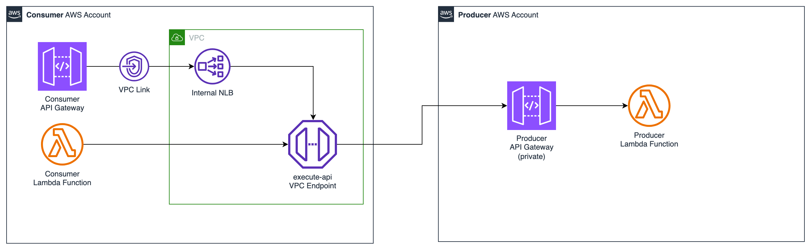
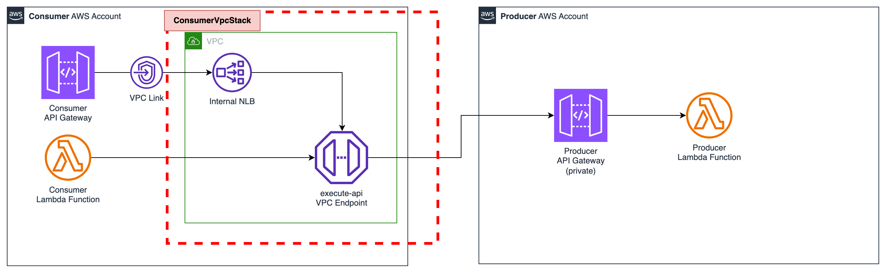
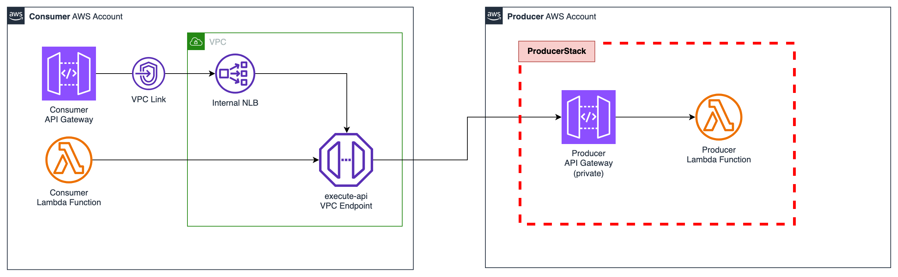
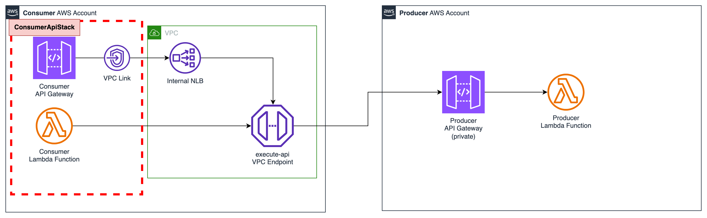
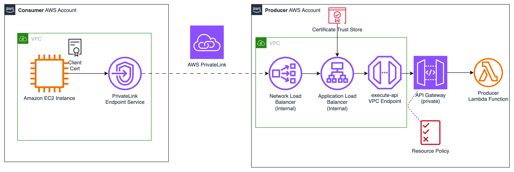

# AWS Cross Account Private API Patterns

This repository contains example patterns for consuming Private API Gateway endpoints across AWS Accounts. 


## Getting Started :checkered_flag:

The examples are provisioned using the Cloud Development Kit (CDK). To install the CDK locally, follow the instructions in the [CDK documentation](https://docs.aws.amazon.com/cdk/v2/guide/getting_started.html#getting_started_install):

```
npm install -g aws-cdk
```

There are 2 example implementations in this repository. The first uses a VPC endpoint to grant access to the consumer AWS account. The second uses mutual TLS (mTLS) and AWS PrivateLink to authorize access using a client certificate.

1. **[VPC Endpoint](#vpce)**

2. **[mTLS via AWS PrivateLink](#mtls)**

## Pattern 1. Cross account via VPC endpoint :electric_plug: {#vpce}



This example uses a VPC endpoint to securely consume a private API from one account via a serverless application in another account. 

```
cd vpc-endpoint
```

With CDK installed, there are then 3 stacks to deploy:
1. `ConsumerVpcStack` - the **consumer account** VPC & VPC Endpoint has to be created first.
2. `ProducerStack` - the **producer account** private API Gateway and Lambda function application is deployed next using the outputs from step 1.
3. `ConsumerApiStack` - finally the **consumer account** API is deployed for securely consuming the private API in the producer account.


### Step 1: Deploy the consumer account VPC [ConsumerVpcStack]

*NOTE: Use the consumer account AWS credentials for this step.*



Bootstrap the CDK environment and install node modules.

```
cd consumer && npm i && cdk bootstrap
```
Deploy the ConsumerVpcStack containing core networking resources. Pass the `producer` AWS account id as a parameter.

```
cdk deploy ConsumerVpcStack --parameters producerAccountId=12345678910
```
Copy the `ConsumerVpcStack.ApiKeySecretArn` and `ConsumerVpcStack.ConsumerVPCe` outputs for the next step.

### Step 2: Deploy the producer private API Gateway application [ProducerStack]

*NOTE: Use the producer account AWS credentials for this step.*



Bootstrap the CDK environment and install node modules.
```
cd ../producer && npm i && cdk bootstrap
```

Deploy the producer API application. Use the `ConsumerVpcStack.ApiKeySecretArn` and `ConsumerVpcStack.ConsumerVPCe` outputs from the first step to pass as parameters (this is used to lock down the trust policy on the private API to just this endpoint):

```
cdk deploy --parameters ConsumerVPCe=vpce-0e3ca9432b3e8cba6 --parameters ApiKeySecretArn=arn:aws:secretsmanager:eu-west-2:12345678910:secret:CrossAccountAPIKeyabc123-def456
```

Take note of the `ProducerStack.ApiUrl` output for the next step.

### Step 3: Deploy the consumer application [ConsumerApiStack]

*NOTE: Use the consumer account AWS credentials for this step.*



Finally deploy the consumer API stack. This is deployed into the consumer AWS account. This will provision the API & Lambda functions that can be used to consume the private API in the producer account. Use the output API URL from the previous stack as a parameter in this final stack (e.g. `https://abc123def.execute-api.eu-west-2.amazonaws.com/prod/widgets`). Also provide the AWS Account ID of the producer account:

```
cd ../consumer
```

```
cdk deploy ConsumerApiStack --parameters targetApiUrl=https://<YOUR API ID>.execute-api.<YOUR REGION>.amazonaws.com/prod/widgets --parameters producerAccountId=12345678910
```

Note the `ConsumerApiStack.ConsumerApiEndpoint` URL to test in the next section.

### Testing

Now the API can be tested using the following curl command. Note the Authorization header. The secret value used for this header can be retrieved from the Secrets Manager Secret `CrossAccountAPIKey` that was created in the consumer account as part of the CDK deployment. This implementation is used for simplicity for development and testing purposes. For production use, you should look at using a more secure authorization method such as AWS IAM or JWT authorization.

```
curl https://<YOUR API ID>.execute-api.<YOUR REGION>.amazonaws.com/prod -H "Authorization: <YOUR SECRET API KEY>"
```

If everything works correctly you should see the below response:
```
{"id":"1","value":"4.99"}
```

You can test the Lambda implementation directly by navigating to the Lambda console in the consumer account and using the "Test" button with the default payload. The function name is `ConsumerApiStack-ConsumerFunction<random-value>`.

If everything works correctly you should see the below response:
```
{
  "statusCode": 200,
  "body": "{\"id\":\"1\",\"value\":\"4.99\"}"
}
```


## Pattern 2. Cross account using mTLS :closed_lock_with_key: {#mtls} 



This example uses mTLS to authenticate communication between a producer and subscriber AWS account. The producer is a private API gateway, fronted by an application load balancer for mTLS resolution. The consumer in this case is just an EC2 instance deployed into another AWS account. 

```
cd alb-mtls
```

This example uses an AWS Private Certificate Authority, but you could follow the same process for any external/3rd party certificate authority. To create a CA to use for mTLS, follow the following steps (can be in any AWS account):

1. Create ACM Private CA, specifying the CN (Common Name) as the domain (e.g. mtls.mydomain.com)
2. Download the generated Certificate.pem and copy it to the `./producer/ca/` folder in the repository
3. Generate client certificates against PCA as per: https://aws.amazon.com/blogs/security/use-acm-private-ca-for-amazon-api-gateway-mutual-tls/ e.g: 

    ```
    openssl req -new -newkey rsa:2048 -days 365 -keyout my_client.key -out my_client.csr
    ```
    ```
    aws acm-pca issue-certificate --certificate-authority-arn arn:aws:acm-pca:us-east-1:account_id:certificate-authority/certificate_authority_id --csr fileb://my_client.csr --signing-algorithm "SHA256WITHRSA" --validity Value=365,Type="DAYS" --template-arn arn:aws:acm-pca:::template/EndEntityCertificate/V1
    ```
    ```
    aws acm-pca get-certificate --certificate-authority-arn arn:aws:acm-pca:us-east-1:account_id:certificate-authority/certificate_authority_id --certificate-arn arn:aws:acm-pca:us-east-1:account_id:certificate-authority/certificate_authority_id/certificate/certificate_id --output text > my_client.pem
    ```

:pencil2: Note, you may have to separate the certificates onto separate lines in the resulting `my_client.pem` file e.g.:

```
...Lw==
-----END CERTIFICATE-----
-----BEGIN CERTIFICATE-----
MIIDKA...
```

(_optional_) - if you set a passphrase on the key you can export it so you don't need to input a passphrase for every request:

```
openssl rsa -in my_client.key -out client.key
```

With the CA configured, there are then 2 stacks to deploy. The producer has to be created first. The producer is the account which the API Gateway is deployed into.

### Step 1: Deploy the producer account stack [ProducerStack]

*NOTE: Use the producer account AWS credentials for this step.*

First bootstrap and deploy the producer stack. This is deployed into the producer AWS account and will create the core networking resources, including the mTLS configuration to be used by the consuming API. The consuming AWS account ID, a subdomain to host the service on, the domain name of the certificate authority and the route53 hosted zone ID for the domain must be provided as parameters:

```
cd producer && npm i && cdk bootstrap
```

```
cdk deploy --parameters consumerAccountId=12345678910 --parameters subdomain=mtls --parameters domainName=mydomain.com --parameters hostedZoneId=ABCDEF123
```

Note the `ProducerStack.ServiceName` output for the next step.

### Step 2: Deploy the consumer account stack [ConsumerStack]

*NOTE: Use the consumer account AWS credentials for this step.*

Then bootstrap and deploy the consumer CDK application. This is deployed into the consumer AWS account. This will provision the VPC endpoint and EC2 instance that will be consume the API from the consumer account. Copy the ServiceName  from the output of the first stack to pass into the consumer stack :

```
cd ../consumer && npm i && cdk bootstrap
```

```
cdk deploy --parameters endpointService=com.amazonaws.vpce.region.vpce-svc-123456abcde
```

Once this stack is deployed, the request to connection with the VPC endpoint must be accepted in the producer AWS account. This is an optional security control to manually verify consumers. 

Then the API can be tested from the EC2 instance in the consumer account. Connect to the instance using Systems Manager Session Manager. You can retrieve the auth token from AWS Secrets Manager in the producer account. The secret ARN is also output from the producer stack for convenience:

```
curl -H "Authorization: WjuAbc232QICxhjGNhPC12345" --key my_client.key --cert my_client.pem https://mtls.mydomain.com/widgets 
```

If everything works correctly you should see the below response:
```
{"id":"1","value":"4.99"}
```

If you try and connect without passing a client certificate and key you will receive an error:
```
curl: (35) Recv failure: Connection reset by peer
```

## Cleanup :moneybag:

Don't forget to spin down all the resources when you are done testing to save costs

```
cdk destroy
```